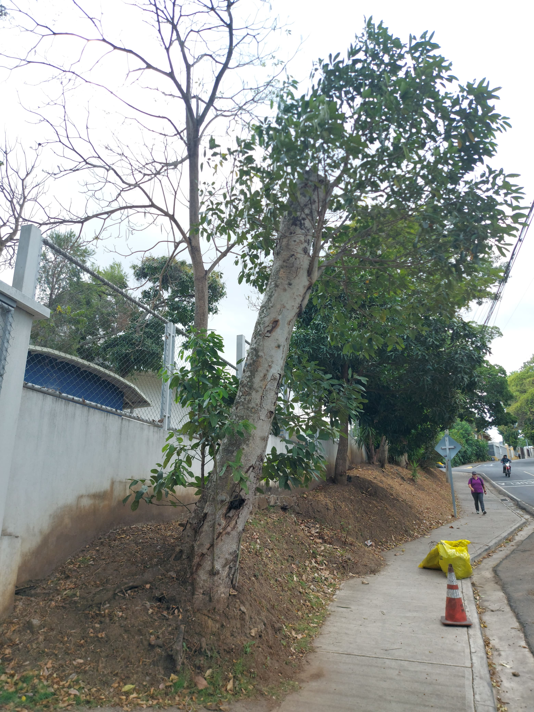

# README.md

# Aristides García Cordero
# B73114

# Inventario Forestal, Municipalidad de Escazú

## Descripción General del Proyecto

El **Inventario Forestal** desarrollado por la **Municipalidad de Escazú** surge como una respuesta a la necesidad de gestionar de manera más eficiente y sostenible los recursos forestales del cantón. Este proyecto se enfoca principalmente en áreas públicas, tales como **parques**, **riberas de ríos**, y **áreas verdes** de gran importancia ecológica. Utilizando herramientas de **Sistemas de Información Geográfica (SIG)** como **ArcGIS Pro** y **Survey123**, se realizó un exhaustivo registro y evaluación del estado de los árboles, con el fin de identificar aquellos que representan un riesgo para la seguridad pública y el medio ambiente.

El objetivo primordial del proyecto era doble: por un lado, **priorizar las intervenciones necesarias**, como la poda o tala de árboles peligrosos; y por otro, **promover iniciativas de reforestación en zonas clave**. Mediante el uso de **SIG**, fue posible optimizar los recursos de la municipalidad, enfocando los esfuerzos en intervenciones precisas y oportunas. Estas tecnologías permitieron **automatizar el análisis de datos espaciales** y generar mapas detallados que facilitaban la toma de decisiones en tiempo real.

Los resultados del proyecto no solo beneficiaron la **seguridad pública**, eliminando potenciales riesgos de accidentes por la caída de árboles, sino que también impulsaron la **conservación de la biodiversidad** y el mejoramiento de la **calidad de vida** de los habitantes. Se ha constatado que la **reforestación** tiene un impacto positivo en la **mitigación del cambio climático** y contribuye a mejorar la calidad del aire, así como a proporcionar refugio y alimento para diversas especies de fauna local.

Además, el inventario incluyó colaboraciones con instituciones como la **Compañía Nacional de Fuerza y Luz (CNFL)**, quienes fueron actores clave en el traslado y poda de árboles en áreas urbanas. Estas colaboraciones **interinstitucionales** fueron vitales para el éxito del proyecto, ya que permitieron una coordinación eficiente entre diferentes actores públicos y privados involucrados en la gestión forestal.

## Descripción de los Datos

Para llevar a cabo este proyecto, los datos fueron recolectados utilizando **Survey123**, una herramienta de captura de datos que permitió registrar información de campo de manera ágil y precisa. Posteriormente, estos datos fueron procesados con **ArcGIS Pro**, lo que facilitó su análisis y visualización en **mapas geoespaciales**.

Las principales variables recolectadas incluyen:

- **Ubicación de los árboles**: Capturada mediante coordenadas **GPS**, lo que permitió la georreferenciación exacta de cada individuo arbóreo en el mapa del cantón.
- **Estado fitosanitario**: Se evaluó el estado de salud de cada árbol, identificando problemas como plagas, enfermedades o daños estructurales que pudieran comprometer su estabilidad.
- **Tipo de intervención**: Dependiendo del estado de cada árbol, se determinó si era necesario aplicar una corta, poda, traslado o realizar acciones de reforestación.
- **Altura y diámetro**: Se midieron las dimensiones de los árboles para obtener un perfil detallado que permitió realizar análisis más exhaustivos, como el cálculo del volumen de biomasa o la estimación del potencial de captura de carbono.

Este conjunto de datos no solo permitió dar seguimiento a los árboles ya intervenidos, sino también establecer bases sólidas para futuras acciones en la gestión forestal del cantón, como la **priorización de nuevas zonas** para reforestación o la identificación de áreas con alta incidencia de árboles en riesgo.

## Archivos Shapefile

Dentro del marco del proyecto, se recopilaron múltiples archivos *shapefile* que contienen información espacial detallada sobre los árboles en riesgo. Estos archivos incluyen datos *geoespaciales* relacionados con la ubicación precisa, el estado fitosanitario, el tipo de intervención y otras características clave de cada árbol. Los *shapefiles* son ampliamente utilizados en el campo de los *Sistemas de Información Geográfica (SIG)* debido a su capacidad para manejar grandes volúmenes de datos espaciales de manera eficiente.

Cada *shapefile* generado durante el proyecto se almacenó en la base de datos *geoespacial* de la Municipalidad de Escazú, permitiendo su uso en futuros análisis y estudios de conservación. Estos archivos son fundamentales para realizar visualizaciones dinámicas de la información, generar reportes y mapas interactivos, y facilitar la colaboración entre departamentos municipales y otros actores involucrados en la gestión ambiental.

## Problemas a Resolver

El **Inventario Forestal** de la Municipalidad de Escazú se desarrolló con el objetivo de abordar varios problemas críticos relacionados con la gestión de los árboles en áreas públicas. Entre los problemas principales que se buscó resolver están:

1. **Identificación de árboles peligrosos para la seguridad pública**: Uno de los mayores desafíos que enfrentan las municipalidades es la detección temprana de árboles que representan un **riesgo significativo** para la seguridad pública. Árboles en estado de **deterioro avanzado** o con daños estructurales debido a plagas, enfermedades o condiciones climáticas extremas, como tormentas o vientos fuertes, pueden caerse y causar accidentes graves. Por lo tanto, uno de los principales problemas que se abordó fue la **identificación y priorización de estos árboles** para intervenciones urgentes, evitando posibles accidentes o daños a la infraestructura pública.

2. **Optimización de los recursos en la gestión forestal mediante SIG**: La **gestión eficiente de los recursos** es otro problema clave. Anteriormente, las intervenciones forestales se realizaban de manera reactiva, sin un análisis exhaustivo de los datos que permitiera una planificación a largo plazo. El uso de **Sistemas de Información Geográfica (SIG)**, como **ArcGIS Pro**, permitió un enfoque más **proactivo** y estratégico. Con la visualización de datos geoespaciales, fue posible **optimizar el uso de recursos financieros y humanos**, priorizando intervenciones en áreas críticas y evitando el desperdicio de recursos en zonas de menor riesgo. Esto también permitió que las decisiones se basaran en datos, mejorando la efectividad de las acciones implementadas.

3. **Determinación de áreas prioritarias para reforestación y conservación**: La **reforestación** es una solución clave para mitigar los efectos negativos del **cambio climático** y conservar la **biodiversidad**. Sin embargo, no todas las áreas son igualmente aptas para proyectos de reforestación. Otro problema importante que se resolvió fue la identificación de las **zonas prioritarias para la reforestación**, tales como las riberas de los ríos y áreas verdes urbanas que juegan un papel crucial en la **recuperación del ecosistema** y en la provisión de servicios ambientales, como la regulación del microclima y la mejora de la calidad del aire. La selección de estas áreas fue posible gracias al análisis detallado de los datos espaciales, lo que permitió un enfoque más **selectivo y dirigido** en las intervenciones.

4. **Mejoramiento de la biodiversidad local**: Otro desafío que enfrentaba el cantón de Escazú era la pérdida de especies arbóreas nativas debido a la deforestación, la expansión urbana y la falta de iniciativas de conservación. Este proyecto permitió identificar **oportunidades para reintroducir especies nativas** y **fomentar la biodiversidad local**. El problema de la **fragmentación del hábitat** también fue abordado a través de la plantación estratégica de árboles en áreas que conectan espacios verdes, promoviendo corredores biológicos para la fauna local.

En resumen, los **problemas críticos** que este proyecto ayudó a resolver incluyeron tanto la **seguridad pública** como la **eficiencia en la gestión de los recursos** y el **aumento de la biodiversidad y la resiliencia climática**.

## Áreas Prioritarias de Intervención

A lo largo del proyecto, se identificaron varias áreas prioritarias para las intervenciones forestales. Estas áreas fueron seleccionadas debido a su **importancia ecológica**, su impacto en la **seguridad pública** y la **necesidad urgente** de conservación y reforestación. Las principales áreas de intervención incluyeron:

- **Parques Municipales**: Los parques son espacios fundamentales para la recreación y el esparcimiento de la comunidad. Sin embargo, muchos árboles en estos parques representaban un **peligro potencial** debido a su estado deteriorado o su ubicación cerca de zonas frecuentadas por la población. Los parques municipales fueron identificados como áreas prioritarias para la **corta de árboles peligrosos** y la **reforestación con especies nativas**, buscando equilibrar la seguridad pública y la conservación del entorno.

- **Áreas Verdes Urbanas**: En Escazú, las áreas verdes urbanas actúan como **pulmones naturales**, ayudando a regular el clima y mejorar la calidad del aire. Además, brindan un refugio para la fauna y flora urbana. No obstante, algunas de estas áreas presentaban **problemas de degradación** debido a la falta de mantenimiento adecuado. Como parte del proyecto, se priorizó la intervención en áreas verdes estratégicas para **revitalizar la biodiversidad** y asegurar que estos espacios continúen ofreciendo **beneficios ecológicos y sociales** a largo plazo.

- **Riberas de Ríos y Quebradas**: Las riberas de los ríos son zonas especialmente sensibles, tanto desde el punto de vista ambiental como de **seguridad pública**. La erosión de las riberas y la caída de árboles inestables representan una **amenaza significativa** para las propiedades cercanas y para la salud de los ecosistemas acuáticos. Durante el inventario forestal, se priorizó la intervención en las riberas de ríos y quebradas con el fin de **estabilizar las laderas** mediante la reforestación y evitar deslizamientos o inundaciones que pudieran tener consecuencias devastadoras.

- **Aceras Públicas**: En las zonas urbanas, muchos árboles se encuentran ubicados en **aceras y áreas públicas** transitadas. Aunque los árboles son esenciales para la creación de sombras y la mejora de la estética urbana, algunos de ellos representan un **riesgo potencial** debido a su ubicación en áreas de tráfico peatonal o vehicular. Se priorizó la **corta de árboles peligrosos** en estas áreas, seguida de la plantación de especies más adecuadas para entornos urbanos, lo que ayudó a mejorar la seguridad sin sacrificar los beneficios ambientales que proporcionan los árboles.

Estas áreas prioritarias se establecieron a partir de un análisis exhaustivo de los datos recolectados, lo que permitió a la Municipalidad de Escazú tomar **decisiones informadas** y asegurar que los recursos se dirigieran a las áreas de **mayor necesidad**.

## Imágenes

## Recursos Externos
Consulta más información sobre **Sistemas de Información Geográfica (SIG)** en [ArcGIS Pro](https://www.esri.com/en-us/arcgis/products/arcgis-pro/overview).
Para más detalles sobre gestión forestal, visita [La Municipalidad de Escazú](https://municipalidadescazu.go.cr).

## Referencias
- [Informe Final de Labores PAAL](https://docs.google.com/document/d/1H7hMhNGqxAXj2jajHflLrlBw_woNpxpqWH82D6VwbXU/edit?usp=sharing)
- [ArcGIS Pro](https://www.esri.com/en-us/arcgis/products/arcgis-pro/overview)
  

